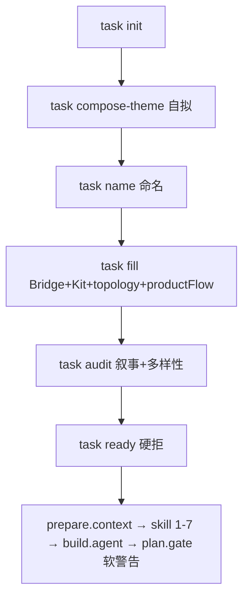

# H5 壳批前准备总计划（自拟主题版）

> **版本**：2026-07-13 v2  
> **背景**：iOS 审核加强后，主题库选题已不适合作产包源；批前准备**移除从主题库抽取**，改为**自拟主题**。  
> 配套：《H5壳交互拓扑与PlanGate策略.md》·《H5壳功能文档深度标准.md》

---

## 1. 问题重述

| 旧链路 | 后果 |
|--------|------|
| 飞书/CSV **主题库抽题** → 填入 6 列 | 主题泛化、叙事雷同 |
| `name_generator._product_flow_from_theme` 单模板 | chip→list→detail→export 连锁 |
| 仅换皮（theme_cn）不换交互拓扑 | 4.3 盯上「同骨架」 |
| plan.gate 深度不足硬拒 | 产包中断成本高 |

**自拟主题**不是「Agent 随便编」，而是**每包一条可上架、可演示、可区分的原创产品叙事**，再由流水线派生 productFlow / topology / 功能文档。

---

## 2. 策略 pivot（相对 v1 计划）

| 维度 | v1（主题库时代） | **v2（自拟主题）** |
|------|------------------|-------------------|
| 主题来源 | `task pick-theme` / 主题库 6 列 | **`task compose-theme` 自拟 brief** |
| `主题编号` | 飞书池 foreign key | **可选** `themeBriefId`（批内序号 `B0714-01`），不绑库 |
| productFlow | 主题库句式 + topology | **自拟场景 + topology 模板** |
| 批前硬拒 | 主题库对齐、编号池 | **叙事去重、反泛化、topology 批内唯一** |
| 设计检索 | Theme blob 中文 | **core_scene/local_feature → 英文 searchQuery**（已有） |
| plan.gate | SPEC/FLOW 软警告 | **不变**（默认续跑） |

---

## 3. 新批前流程（取代主题库抽题）



### 命令序（目标态）

```bash
./run.sh task-init --batch-id TEST-0714 --rows 6
./run.sh task-compose-theme          # NEW — 自拟或 Agent 辅助
./run.sh task-name                   # NEW — 从自拟 brief 产名（非 pick-theme）
./run.sh task-fill [--force]
./run.sh task-audit
./run.sh task-ready
./run.sh --name Buildioo
```

### 废弃 / 降级（不再作为批前主路径）

| 项 | 处置 |
|----|------|
| `task pick-theme` / `task_pick_theme.py` | **废弃**（保留代码只读，CLI 隐藏） |
| `feishu sync-theme` 作 prep 门禁 | **关闭**（`task_feishu_sync` 不参与 ready） |
| `data/registry/themes-cn.txt` 作选题源 | **只读归档**，不注入新批次 |
| `主题编号` 与在线表对齐校验 | **移除** ready 硬约束 |
| 文档「主题库 6 列人工抄表」 | 改为 **自拟 brief 规范** |

---

## 4. 自拟主题 brief 规范（每行 task.csv）

### 4.1 必填字段（人工或 `task compose-theme`）

| 列 | 要求 | 反例 |
|----|------|------|
| `中文主题` | **≤40 字**，一句可上架定位 | 「关于陪读家长开学物品…记录本」长句堆砌 |
| `赛道分类` | 具体垂类 | 泛「工具」「生活」 |
| `目标人群` | 可画像人群 | 「用户」「所有人」 |
| `核心场景` | **一个**主场景动词短语 | 「日常使用」「管理」 |
| `本地功能` | **一个**差异化机制（非 list/export） | 「记录本」「日记」 |
| `productFlow` | 由 fill 根据 **topology + 上四列** 生成，不手写 CRUD 句 | chip browse 模板 |

### 4.2 自拟质量 rubric（task-audit 软→硬）

每包 brief 须满足：

1. **可演示**：审核员 30 秒内能说清「这 App 做什么」
2. **可区分**：批内 `核心场景` + `本地功能` 二元组不重复
3. **非套壳叙事**：不出现「浏览列表 / 分类筛选 / 周报导出」作为**主卖点**（可作辅能力）
4. **专业锚点**：含 ≥1 个领域词（如 budget cap、session checklist、reminder ring）
5. **与 topology 一致**：`task fill` 分配的 T1–T8 须能支撑 brief（audit 校验）

### 4.3 与交互拓扑的关系（已实现，保留）

```
自拟 brief（核心场景/本地功能）
    → task fill 分配 interactionTopology（T1–T8，批内去重）
    → generate_product_flow_for_topology()
    → skill-input.context.json
    → PM prompt TOPOLOGY_BLOCK + BUSINESS_DEPTH_BLOCK
```

**topology 推断可加强**：按 `核心场景/本地功能` 关键词推荐 T6/T8 等，而非纯 seed 哈希。

---

## 5. Gate 分层（修订后）

### 5.1 产包前 — **硬拒**（成本低，应在此消化 4.3 风险）

| 检查 | 脚本 | 说明 |
|------|------|------|
| CSV 必填 / 去重 | `batch_firewall` | 全称、商品 Code、应用名 |
| **批内 topology 重复** | `interaction_topology` | ✅ 已实现 |
| **批内 核心场景+本地功能 重复** | `theme_audit`（待做） | 自拟去重核心 |
| **中文主题 批内重复** | `batch_firewall` | ✅ 已有 |
| 叙事泛化禁句 | `theme_audit`（待做） | 如仅「清单管理工具」 |
| 登记表主题相似度 | `audit_task_registry_similarity` | ✅ 已有 |
| ~~主题库在线对齐~~ | ~~feishu~~ | **移除** |

### 5.2 产包中 `plan.gate` — **默认软警告续跑**

| 类型 | 内容 |
|------|------|
| HARD | 文件缺失、JSON 非法、登记必填空、MASTER 缺失 |
| SOFT | SPEC 深度、FLOW 同构、SEL 选型、蓝图深度 |

环境变量：`STRICT_PLAN_GATE=0`（默认）· `STRICT_PLAN_GATE=1`（调试）

---

## 6. 实施路线图（修订）

### Phase 0 — 文档与策略（本文件 + 下游对齐）✅

- [x] 本总计划 v2
- [x] 更新 `docs/rules/批次准备规则.md` — 自拟主题取代主题库
- [x] 更新 `docs/rules/主题防火墙说明.md` — 移除「主题库统一来源」

### Phase 1 — 自拟主题引擎（P0）✅

| # | 任务 | 文件 |
|---|------|------|
| 1.1 | `task compose-theme` CLI | `task_compose_theme.py` `task_cli.py` |
| 1.2 | 自拟 brief 校验 | `theme_audit.py` |
| 1.3 | `task-ready` 挂 audit + 推荐清单 | `batch_firewall.py` |
| 1.4 | 废弃 `pick-theme` 入口 | `task_cli` / 交互菜单（无 pick-theme） |

### Phase 2 — 反同构（P0）✅

| # | 任务 | 状态 |
|---|------|------|
| 2.1 | interaction topology deck | ✅ |
| 2.2 | productFlow 去 CRUD 模板 | ✅ |
| 2.3 | plan.gate 软硬分层 + report | ✅ |
| 2.4 | topology 按 brief 关键词推荐 | ✅ |

### Phase 3 — 功能文档深度（P0）✅

- SPEC 软警告 · BUSINESS_DEPTH_BLOCK · Deliverable 1 模板

### Phase 4 — 产包续跑体验（P1）✅

- `plan_gate_repair.py` — SOFT/HARD 定向补写 + 限轮重验
- `phase_plan_gate_repair.txt` — repair Agent prompt

### Phase 5 — 清理（P2）

- 移除 `task_feishu_sync` 在 `task-ready` 的调用链
- `theme_library.py` 标记 legacy
- global-brain 沉淀 pitfalls

---

## 7. Buildioo 批次迁移示例

**现状问题**：`中文主题` 为库式长句；productFlow 曾是 CRUD 模板。

**迁移步骤**：

```bash
# 1. 手改或 compose-theme 重写 brief，例如：
# 中文主题: 陪读家长开学采购会话清单
# 核心场景: 开学采购会话勾选
# 本地功能: 预算上限行项提醒

./run.sh task-fill --force    # 重分 topology + productFlow
./run.sh task-ready

# 2. 重跑 prepare.context（刷新 skill-input constraints）
# 3. 续跑 build.agent
./run.sh --name Buildioo
```

预期：topology **T6_checklist_session**；productFlow 为会话清单句式；plan.gate 出 WARN 不断线。

---

## 8. 与 4.3 的分工（自拟主题时代）

| 4.3 关切 | 防线 |
|----------|------|
| 主题/叙事雷同 | **自拟 brief audit** + registry Jaccard |
| 交互同构 | **topology 批内去重** + FLOW 软警告 |
| 代码相似 | Bridge 七维 + 命名混淆（已有） |
| H5 视觉同源 | 允许；**主流程不得同构** |
| 功能薄/套壳 | **业务深度 SPEC** + 4.2 Native Offset |

---

## 9. 决策记录

| 决策 | 选择 | 理由 |
|------|------|------|
| 主题来源 | **自拟** | 主题库已不适配 iOS 加强后审核 |
| 主题编号 | **降级为批内序号** | 不再绑飞书池 |
| 产包中 gate | **软警告默认** | 避免 Agent 已跑后断线 |
| 产包前 gate | **加强叙事+topology** | 风险前置成本最低 |
| productFlow | **topology 模板，非 CRUD** | 断连锁反应源头 |

---

## 导航

- [[H5壳交互拓扑与PlanGate策略.md]]
- [[H5壳功能文档深度标准.md]]
- [[rules/批次准备规则.md]]（待更新）
- [[rules/主题防火墙说明.md]]（待更新）
